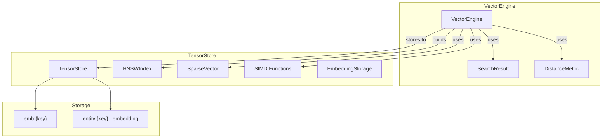
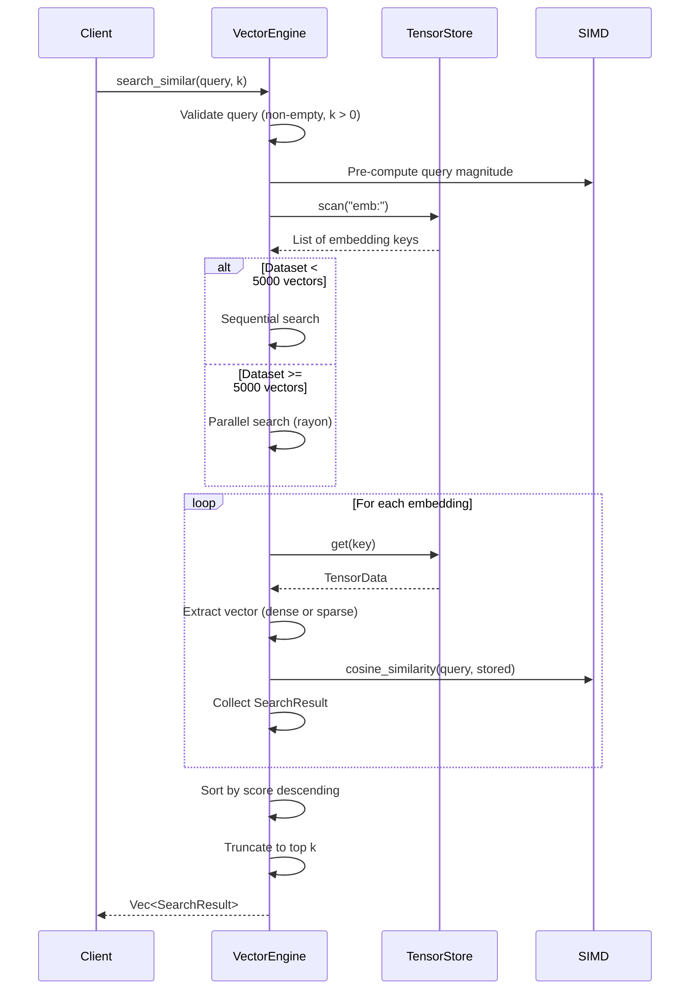
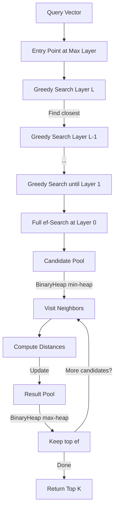
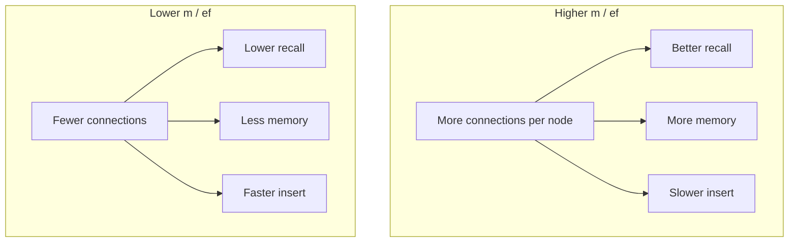
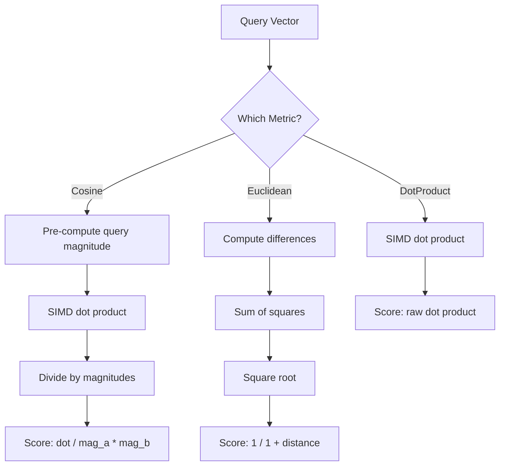

# Vector Search Modes

How the Vector Engine selects and executes different search strategies, from
brute-force scanning to HNSW approximate nearest-neighbor search.

> **See Also:**
> [Vector Engine API Reference](../reference/api/vector-engine.md) |
> [Filtered Search Design](filtered-search-design.md) |
> [Embeddings Search How-To](../how-to/embeddings-search.md)

## Architecture Overview

The Vector Engine is Module 4 of Neumann. It builds on `tensor_store` to provide
k-NN search capabilities with SIMD-accelerated distance computations. The engine
depends only on Tensor Store for persistence and inherits thread safety from
its sharded storage design.



### Design Principles

| Principle | Description |
| --- | --- |
| Layered Architecture | Depends only on Tensor Store for persistence |
| Multiple Distance Metrics | Cosine, Euclidean, and Dot Product similarity |
| SIMD Acceleration | 8-wide SIMD for dot products and magnitudes |
| Dual Search Modes | Brute-force O(n) or HNSW O(log n) |
| Unified Entities | Embeddings can be attached to shared entities |
| Thread Safety | Inherits from Tensor Store |
| Serializable Types | All types implement `serde::Serialize`/`Deserialize` |
| Automatic Sparsity Detection | Vectors with >50% zeros stored efficiently |

## Brute-Force vs HNSW

The engine provides two search modes with fundamentally different tradeoffs.

### Brute-Force Search (O(n * d))

Brute-force search scans every embedding, computes the distance to the query
vector, and returns the top-k results sorted by score. It is exact -- it will
always find the true nearest neighbors.

**When to use brute-force:**

- Dataset has fewer than ~10,000 vectors
- You need guaranteed exact results
- You need a distance metric other than cosine (Euclidean, DotProduct)
- The dataset changes frequently and rebuilding an index is impractical

**How it works internally:**



### HNSW Search (O(log n * ef * m))

HNSW (Hierarchical Navigable Small World) is a graph-based index that enables
approximate nearest-neighbor search in logarithmic time. The index must be built
ahead of time, after which searches traverse the multi-layer graph structure
instead of scanning all vectors.

**When to use HNSW:**

- Dataset has more than ~10,000 vectors
- Cosine similarity is acceptable (HNSW uses cosine internally)
- You can afford the memory overhead (~2-4x)
- The dataset is relatively static (no deletion support)

**How HNSW search works:**



The search starts at the top layer with a single entry point and greedily
descends through layers, narrowing the search space. At layer 0, it performs a
full beam search with `ef_search` candidates, exploring neighbor connections to
find the closest vectors.

### Choosing Between Search Modes

| Criterion | Brute-Force | HNSW |
| --- | --- | --- |
| Dataset size < 10K | Preferred | Overhead not worth it |
| Dataset size > 100K | Too slow | Preferred |
| Exact results required | Yes | No (approximate) |
| Distance metric | Any | Cosine only |
| Memory overhead | None | 2-4x |
| Dynamic inserts/deletes | Supported | Rebuild required |
| Build time | None | O(n * log n * ef_construction * m) |

### Workload-Specific Tuning

| Workload | Recommended Config | Rationale |
| --- | --- | --- |
| RAG/Semantic Search | `high_recall()` | Accuracy critical |
| Real-time recommendations | `high_speed()` | Latency critical |
| Batch processing | `default()` | Balanced |
| Small dataset (<10K) | Brute-force | HNSW overhead not worth it |
| Large dataset (>100K) | `default()` with higher ef_search | Scale benefits |

## HNSW Tuning Rationale



The `m` parameter controls how many connections each node maintains per layer.
Higher values create a denser graph that is more likely to find the true nearest
neighbor at the cost of memory and insert time. The `ef_search` parameter
controls how many candidates are evaluated during search -- higher values improve
recall but increase latency.

## Automatic Parallel Search

When the dataset exceeds the `parallel_threshold` (default 5000), brute-force
search automatically switches from sequential to parallel iteration using rayon:

```rust
const PARALLEL_THRESHOLD: usize = 5000;

if keys.len() >= PARALLEL_THRESHOLD {
    // Use rayon parallel iterator
    keys.par_iter().filter_map(...)
} else {
    // Use sequential iterator
    keys.iter().filter_map(...)
}
```

This threshold is configurable via `VectorEngineConfig::with_parallel_threshold()`.

## Automatic Sparsity Detection

The engine automatically detects sparse vectors and stores them in a
memory-efficient format. A vector is classified as sparse when more than 50% of
its elements are zero (or near-zero):

```rust
// Detection threshold: nnz * 2 <= len (i.e., sparsity >= 50%)
fn should_use_sparse(vector: &[f32]) -> bool {
    let nnz = vector.iter().filter(|&&v| v.abs() > 1e-6).count();
    nnz * 2 <= vector.len()
}
```

### Storage Format Comparison

| Format | Memory per Element | Best For |
| --- | --- | --- |
| Dense | 4 bytes | Sparsity < 50% |
| Sparse | 8 bytes per non-zero (4 pos + 4 val) | Sparsity > 50% |

Example: a 1000-dimension vector with 100 non-zeros uses 4000 bytes dense but
only 800 bytes sparse (5x compression).

### SparseVector Memory Layout

```text
SparseVector {
    dimension: usize,        // Total vector dimension
    positions: Vec<u32>,     // Sorted indices of non-zeros
    values: Vec<f32>,        // Corresponding values
}
```

Sparse dot products use a merge-sort style traversal of the sorted position
arrays, achieving O(min(nnz_a, nnz_b)) complexity for sparse-sparse operations
and O(nnz) for sparse-dense operations.

## SIMD Acceleration

The engine uses 8-wide SIMD operations via the `wide` crate (transitive
dependency through `tensor_store`). The SIMD dot product processes 8 floats per
instruction:

```rust
// Simplified view of the SIMD implementation
pub fn dot_product(a: &[f32], b: &[f32]) -> f32 {
    let chunks = a.len() / 8;
    let remainder = a.len() % 8;

    let mut sum = f32x8::ZERO;

    for i in 0..chunks {
        let offset = i * 8;
        let va = f32x8::from(&a[offset..offset + 8]);
        let vb = f32x8::from(&b[offset..offset + 8]);
        sum += va * vb;  // Parallel multiply-add
    }

    let arr: [f32; 8] = sum.into();
    let mut result: f32 = arr.iter().sum();

    let start = chunks * 8;
    for i in 0..remainder {
        result += a[start + i] * b[start + i];
    }

    result
}
```

SIMD operations are cache-friendly due to sequential memory access patterns,
achieving 6-8x speedup at typical embedding dimensions (384-3072).

## Distance Metric Implementation



### Cosine Similarity Edge Cases

- Zero-magnitude vectors return `0.0` similarity (division by zero guarded)
- Identical vectors return `1.0`
- Opposite vectors return `-1.0`
- Orthogonal vectors return `0.0`
- NaN/Inf results are sanitized: cosine returns `0.0`, distance returns `1.0`

## Related Pages

- [Vector Engine API Reference](../reference/api/vector-engine.md) -- complete type and configuration tables
- [Filtered Search Design](filtered-search-design.md) -- how metadata filtering interacts with search
- [Sparse Vectors](sparse-vectors.md) -- deep dive on sparse vector internals
- [Embeddings Search How-To](../how-to/embeddings-search.md) -- step-by-step usage guide
