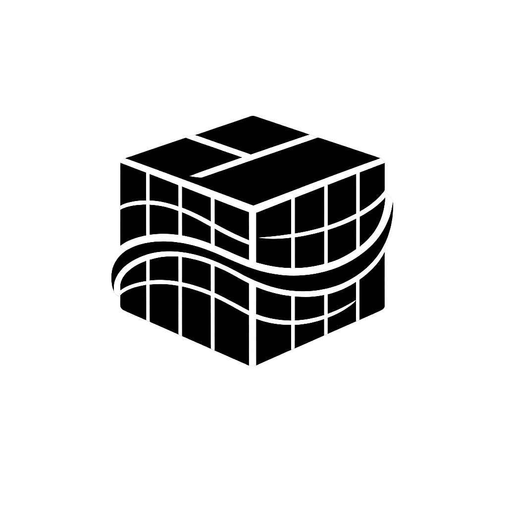
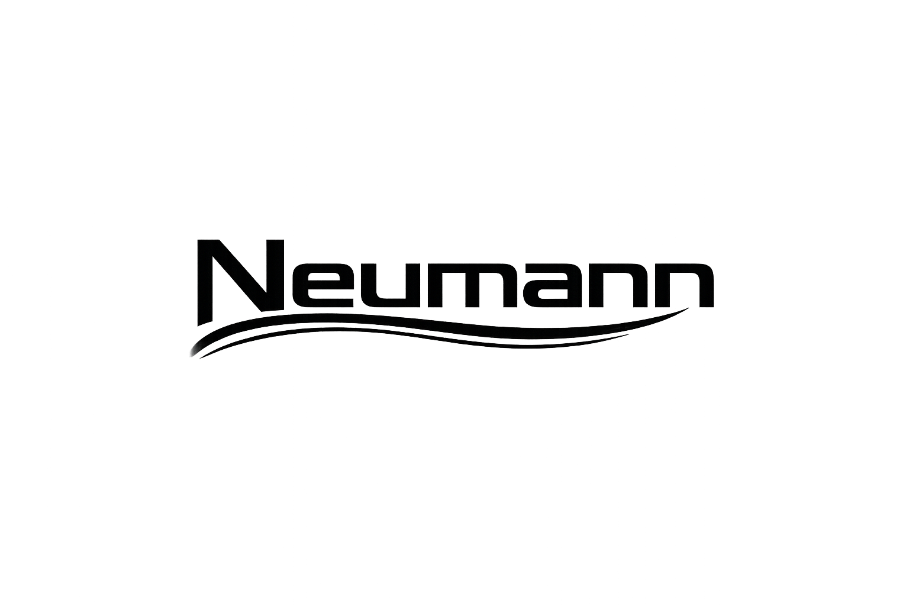

# Introduction

<p align="center">
  
  
</p>

Neumann is a unified tensor-based runtime that stores relational data, graph
relationships, and vector embeddings in a single system. Instead of stitching
together a SQL database, a graph store, and a vector index, Neumann gives you
all three behind one query language.

## Choose Your Path

| I want to... | Go to |
|---|---|
| Try it in 5 minutes | [Quick Start](tutorials/quick-start.md) |
| Build a project with it | [Five-Minute Tutorial](tutorials/five-minute-rag.md) |
| See what it can do | [Use Cases](tutorials/use-cases.md) |
| Understand the design | [Architecture Overview](explanation/architecture-overview.md) |
| Use the Python SDK | [Python Quickstart](tutorials/python-sdk.md) |
| Use the TypeScript SDK | [TypeScript Quickstart](tutorials/typescript-sdk.md) |
| Look up a command | [Query Language Reference](reference/query-language.md) |

## What Makes Neumann Different

**One system, three engines.** Store a table, connect entities in a graph, and
search by vector similarity without moving data between systems.

```sql
-- Relational
CREATE TABLE documents (id INT PRIMARY KEY, title TEXT, author TEXT);
INSERT INTO documents VALUES (1, 'Intro to ML', 'Alice');

-- Graph
NODE CREATE topic { name: 'machine-learning' }
ENTITY CONNECT 'doc-1' -> 'topic-ml' : covers

-- Vector
EMBED STORE 'doc-1' [0.1, 0.2, 0.3, 0.4]

-- Cross-engine: find similar documents connected to a topic
SIMILAR 'doc-1' LIMIT 5 CONNECTED TO 'topic-ml'
```

**Encrypted vault.** Store secrets with AES-256-GCM encryption and graph-based
access control.

**LLM cache.** Cache LLM responses with exact and semantic matching to reduce
API costs.

**Built-in consensus.** Raft-based distributed consensus with 2PC transactions
for multi-node deployments.

## Architecture

```text
                    +-------------------+
                    |   neumann_shell   |    Interactive CLI
                    |   neumann_server  |    gRPC server
                    +-------------------+
                             |
                    +-------------------+
                    |   query_router    |    Unified query execution
                    +-------------------+
                             |
        +----------+---------+---------+----------+
        |          |         |         |          |
   relational   graph    vector    tensor_    tensor_
   _engine     _engine  _engine   _vault     _cache
        |          |         |         |          |
        +----------+---------+---------+----------+
                             |
                    +-------------------+
                    |   tensor_store    |    Core storage (HNSW, sharded B-trees)
                    +-------------------+
```

Additional subsystems: `tensor_blob` (S3-style blob storage), `tensor_chain`
(blockchain with Raft), `tensor_checkpoint` (snapshots), `tensor_compress`
(tensor train decomposition).

## Getting Started

- [Installation](how-to/installation.md) -- Install Neumann
- [Quick Start](tutorials/quick-start.md) -- Your first queries
- [Five-Minute Tutorial](tutorials/five-minute-rag.md) -- Build a mini RAG system
- [Use Cases](tutorials/use-cases.md) -- Real-world applications
- [Building from Source](how-to/building-from-source.md) -- Compile from source

## Reference

- [Query Language](reference/query-language.md) -- Full command reference
- [Data Types](reference/data-types.md) -- Scalar, vector, and sparse types
- [Functions](reference/functions.md) -- Aggregates, distance metrics, operators
- [Rustdoc](reference/rustdoc.md) -- Rustdoc output
