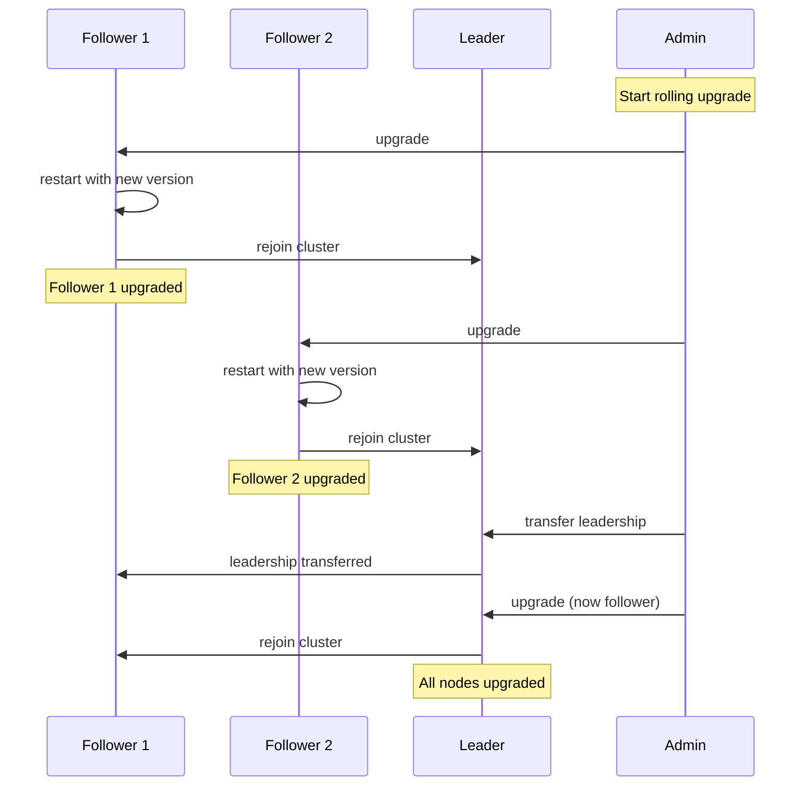

# Cluster Upgrade

This runbook covers upgrading tensor_chain clusters with minimal downtime.

## Upgrade Types

| Type | Downtime | Complexity | Use Case |
| --- | --- | --- | --- |
| Rolling | None | Low | Minor version upgrades |
| Blue-Green | Minimal | Medium | Major version upgrades |
| Canary | None | High | Risk-sensitive environments |

## Rolling Upgrade

Upgrade nodes one at a time while maintaining cluster availability.

### Prerequisites

- [ ] Cluster has 3+ nodes for quorum during upgrades
- [ ] New version is backwards compatible with current version
- [ ] Upgrade tested in staging environment
- [ ] Backup of cluster state completed

### Symptoms (Why Upgrade)

- Security patches available
- New features required
- Bug fixes needed
- Performance improvements available

### Upgrade Sequence



### Procedure

#### Step 1: Pre-upgrade checks

```bash
# Verify cluster health
neumann cluster health

# Check current versions
neumann cluster versions

# Verify backup is current
neumann backup status
```

#### Step 2: Upgrade followers first

```bash
# For each follower node:

# 1. Drain the node
neumann node drain node2

# 2. Stop the service
ssh node2 "systemctl stop neumann"

# 3. Upgrade the binary
ssh node2 "cargo install neumann --version X.Y.Z"

# 4. Start the service
ssh node2 "systemctl start neumann"

# 5. Verify rejoin
neumann cluster members

# 6. Wait for replication catch-up
neumann metrics node2 | grep replication_lag
```

#### Step 3: Upgrade the leader

```bash
# Transfer leadership to an upgraded follower
neumann raft transfer-leadership --to node2

# Verify leadership transferred
neumann raft status

# Now upgrade the old leader (same steps as followers)
neumann node drain node1
ssh node1 "systemctl stop neumann"
ssh node1 "cargo install neumann --version X.Y.Z"
ssh node1 "systemctl start neumann"
```

#### Step 4: Post-upgrade verification

```bash
# Verify all nodes on new version
neumann cluster versions

# Expected output:
# ID     VERSION
# node1  X.Y.Z
# node2  X.Y.Z
# node3  X.Y.Z

# Run health checks
neumann cluster health

# Verify functionality with test transactions
neumann test-transaction
```

## Version Compatibility

### Compatibility Matrix

| From Version | To Version | Compatible | Notes |
| --- | --- | --- | --- |
| 0.9.x | 0.10.x | Yes | Rolling upgrade supported |
| 0.10.x | 0.11.x | Yes | Rolling upgrade supported |
| 0.8.x | 0.10.x | No | Blue-green required |
| 0.x.x | 1.0.x | No | Blue-green required |

### Version Skew Policy

- **Maximum skew**: 1 minor version during rolling upgrades
- **Leader version**: Must be >= follower versions
- **Upgrade order**: Always followers first, then leader

## Rollback Procedure

If issues are discovered after upgrade:

### Symptoms Requiring Rollback

- Transaction failures after upgrade
- Performance degradation
- Consensus failures
- Data corruption detected

### Rollback Steps

```bash
# 1. Stop accepting new requests
neumann cluster pause

# 2. Identify problematic nodes
neumann cluster health --verbose

# 3. Rollback affected nodes
ssh node1 "cargo install neumann --version X.Y.Z-OLD"
ssh node1 "systemctl restart neumann"

# 4. Verify rollback
neumann cluster versions

# 5. Resume operations
neumann cluster resume
```

### Rollback Limitations

- Cannot rollback if schema changes were applied
- Cannot rollback if new features were used
- Always test rollback in staging first

## Canary Upgrade

For risk-sensitive environments, upgrade a single node first and monitor.

### Procedure

```bash
# 1. Select canary node (typically a follower)
CANARY=node3

# 2. Upgrade canary
neumann node drain $CANARY
ssh $CANARY "cargo install neumann --version X.Y.Z"
ssh $CANARY "systemctl restart neumann"

# 3. Monitor canary for 24-48 hours
neumann metrics $CANARY --watch

# 4. Compare metrics with non-canary nodes
neumann metrics compare $CANARY node1

# 5. If healthy, proceed with rolling upgrade
# If unhealthy, rollback canary
```

### Canary Success Criteria

| Metric | Threshold | Action if Exceeded |
| --- | --- | --- |
| Error rate | < 0.1% | Rollback |
| Latency p99 | < 2x baseline | Investigate |
| Replication lag | < 100ms | Investigate |
| Memory usage | < 1.5x baseline | Investigate |

## Automated Upgrade Script

```bash
#!/bin/bash
# rolling-upgrade.sh - Automated rolling upgrade script

set -e

NEW_VERSION=$1
NODES=$(neumann cluster members --format json | jq -r '.[] | .id')
LEADER=$(neumann raft status --format json | jq -r '.leader')

echo "Upgrading cluster to version $NEW_VERSION"

# Upgrade followers first
for node in $NODES; do
    if [ "$node" == "$LEADER" ]; then
        continue
    fi

    echo "Upgrading follower: $node"
    neumann node drain $node
    ssh $node "cargo install neumann --version $NEW_VERSION"
    ssh $node "systemctl restart neumann"

    # Wait for rejoin
    sleep 10
    neumann cluster wait-healthy --timeout 120
done

# Transfer leadership and upgrade old leader
echo "Transferring leadership from $LEADER"
NEW_LEADER=$(echo $NODES | tr ' ' '\n' | grep -v $LEADER | head -1)
neumann raft transfer-leadership --to $NEW_LEADER

sleep 5

echo "Upgrading old leader: $LEADER"
neumann node drain $LEADER
ssh $LEADER "cargo install neumann --version $NEW_VERSION"
ssh $LEADER "systemctl restart neumann"

# Final verification
neumann cluster wait-healthy --timeout 120
neumann cluster versions

echo "Upgrade complete"
```

## See Also

- [Node Management](node-management.md)
- [Backup and Restore](backup-restore.md)
- [Configuration](../configuration.md)
