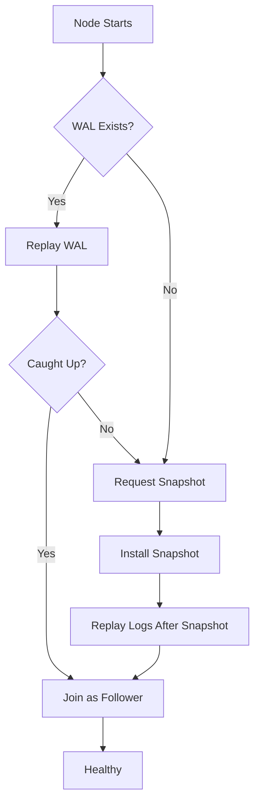

# Node Recovery

## Recovery Scenarios

| Scenario | Recovery Method | Data Loss Risk |
| --- | --- | --- |
| Process crash | WAL replay | None |
| Node reboot | WAL replay | None |
| Disk failure | Snapshot + log from leader | Possible (uncommitted) |
| Data corruption | Snapshot from leader | Possible (uncommitted) |

## Automatic Recovery Flow



## Manual Recovery Steps

### 1. Crash Recovery (WAL Intact)

```bash
# Just restart - WAL replay is automatic
systemctl start neumann

# Monitor recovery
journalctl -u neumann -f | grep -E "(recovery|replay|caught_up)"
```

### 2. Recovery from Snapshot

```bash
# 1. Stop node
systemctl stop neumann

# 2. Clear corrupted state
rm -rf /var/lib/neumann/raft/wal/*

# 3. Keep or clear snapshots (keep if valid)
ls -la /var/lib/neumann/raft/snapshots/

# 4. Restart - will fetch snapshot from leader
systemctl start neumann

# 5. Monitor snapshot transfer
watch -n1 'curl -s localhost:9090/metrics | grep snapshot_transfer'
```

### 3. Full State Rebuild

```bash
# 1. Stop node
systemctl stop neumann

# 2. Clear all Raft state
rm -rf /var/lib/neumann/raft/*

# 3. Clear tensor store (will be rebuilt)
rm -rf /var/lib/neumann/store/*

# 4. Restart
systemctl start neumann
```

## Monitoring Recovery Progress

```bash
# Check sync status
curl -s localhost:9090/metrics | grep -E "(commit_index|applied_index|leader_commit)"

# Calculate lag
LEADER_COMMIT=$(curl -s http://leader:9090/metrics | grep tensor_chain_commit_index | awk '{print $2}')
MY_APPLIED=$(curl -s localhost:9090/metrics | grep tensor_chain_applied_index | awk '{print $2}')
echo "Lag: $((LEADER_COMMIT - MY_APPLIED)) entries"

# Estimated time to catch up (entries/sec)
watch -n5 'curl -s localhost:9090/metrics | grep tensor_chain_applied_index'
```

## Troubleshooting

### Recovery Stuck

**Symptom**: Node not catching up, applied_index not increasing

**Causes**:

1. Network issue to leader
2. Leader overloaded
3. Snapshot transfer failing

**Solution**:

```bash
# Check leader connectivity
curl -v http://leader:7878/health

# Check snapshot transfer errors
grep "snapshot" /var/log/neumann/tensor_chain.log | grep -i error

# Manually trigger snapshot
curl -X POST http://leader:9090/admin/snapshot
```

### Repeated Crashes During Recovery

**Symptom**: Node crashes while replaying WAL

**Causes**:

1. Corrupted WAL entry
2. Out of memory during replay
3. Incompatible schema

**Solution**:

```bash
# Skip corrupted entries (data loss!)
neumann-admin wal-repair --skip-corrupted

# Or full rebuild
rm -rf /var/lib/neumann/raft/*
systemctl start neumann
```
