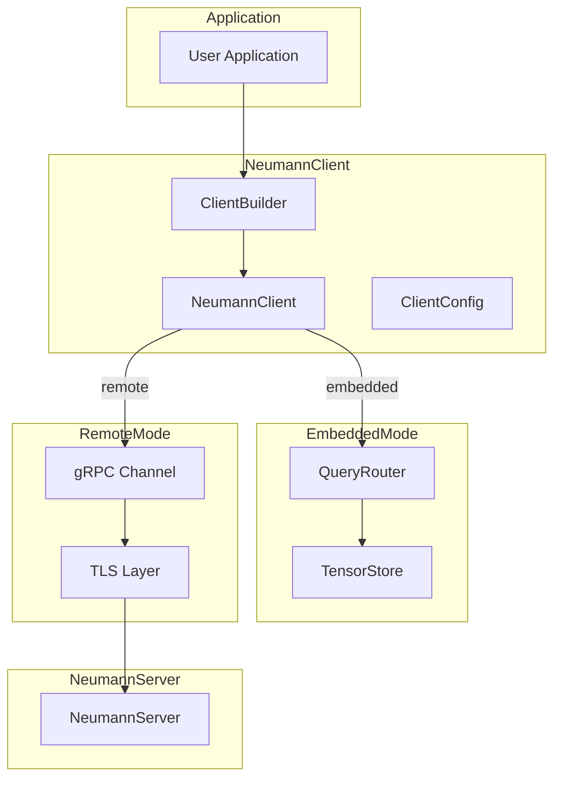
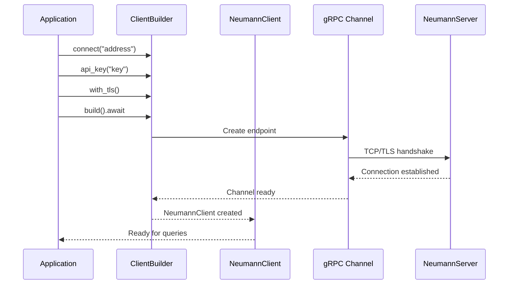

# Neumann Client API Reference

> **See Also:**
> - [Neumann Server API](neumann-server.md) -- server counterpart for remote mode
> - [TypeScript SDK API](neumann-ts.md) -- TypeScript client with same capabilities
> - [Python SDK API](neumann-py.md) -- Python client with same capabilities
> - [Neumann Shell API](neumann-shell.md) -- interactive CLI (alternative interface)

The Neumann Client (`neumann_client`) provides a Rust SDK for interacting with
the Neumann database. It supports two modes: embedded mode for in-process
database access via the Query Router, and remote mode for network access via
gRPC to a Neumann Server.

The client follows four design principles: dual-mode flexibility (same API for
embedded and remote), security-first (API keys are zeroized on drop),
async-native (built on tokio for remote operations), and zero-copy where
possible (streaming results for large datasets).

## Architecture Overview



## Key Types

| Type | Description |
| --- | --- |
| `NeumannClient` | Main client struct supporting both embedded and remote modes |
| `ClientBuilder` | Fluent builder for remote client connections |
| `ClientConfig` | Configuration for remote connections (address, API key, TLS) |
| `ClientMode` | Enum: `Embedded` or `Remote` |
| `ClientError` | Error type for client operations |
| `RemoteQueryResult` | Wrapper for proto query response with typed accessors |
| `QueryResult` | Re-export of query_router result type (embedded mode) |

## Client Modes

| Mode | Feature Flag | Use Case |
| --- | --- | --- |
| Embedded | `embedded` | In-process database, unit testing, CLI tools |
| Remote | `remote` (default) | Production gRPC connections to server |
| Full | `full` | Both modes available |

### Feature Flags

```toml
[dependencies]
# Remote only (default)
neumann_client = "0.1"

# Embedded only
neumann_client = { version = "0.1", default-features = false, features = ["embedded"] }

# Both modes
neumann_client = { version = "0.1", features = ["full"] }
```

## Client Configuration

| Field | Type | Default | Description |
| --- | --- | --- | --- |
| `address` | `String` | `localhost:9200` | Server address (host:port) |
| `api_key` | `Option<String>` | `None` | API key for authentication |
| `tls` | `bool` | `false` | Enable TLS encryption |
| `timeout_ms` | `u64` | `30000` | Request timeout in milliseconds |

### API Key Zeroization

API keys are automatically zeroed from memory when the configuration is dropped
to prevent credential leakage:

```rust
impl Drop for ClientConfig {
    fn drop(&mut self) {
        if let Some(ref mut key) = self.api_key {
            key.zeroize();  // Overwrites memory with zeros
        }
    }
}
```

## Remote Mode

### Connection Builder

```rust
use neumann_client::NeumannClient;

// Minimal connection
let client = NeumannClient::connect("localhost:9200")
    .build()
    .await?;

// Full configuration
let client = NeumannClient::connect("db.example.com:9443")
    .api_key("sk-production-key")
    .with_tls()
    .timeout_ms(60_000)
    .build()
    .await?;
```

### Connection Flow



### Query Execution

```rust
// Single query
let result = client.execute("SELECT * FROM users").await?;

// With identity (for vault access)
let result = client
    .execute_with_identity("VAULT GET 'secret'", Some("service:backend"))
    .await?;

// Batch queries
let results = client
    .execute_batch(&[
        "CREATE TABLE orders (id:int, total:float)",
        "INSERT orders id=1, total=99.99",
        "SELECT orders",
    ])
    .await?;
```

### RemoteQueryResult Accessors

```rust
let result = client.execute("SELECT * FROM users").await?;

// Check for errors
if result.has_error() {
    eprintln!("Error: {}", result.error_message().unwrap());
}

// Check result type
if result.is_empty() {
    println!("No results");
}

// Access typed data
if let Some(count) = result.count() { println!("Count: {}", count); }
if let Some(rows) = result.rows() { /* ... */ }
if let Some(nodes) = result.nodes() { /* ... */ }
if let Some(edges) = result.edges() { /* ... */ }
if let Some(similar) = result.similar() { /* ... */ }

// Access raw proto response
let proto = result.into_inner();
```

### Blocking Connection

For synchronous contexts:

```rust
let client = NeumannClient::connect("localhost:9200")
    .api_key("test-key")
    .build_blocking()?;  // Creates temporary tokio runtime
```

## Embedded Mode

### Creating an Embedded Client

```rust
use neumann_client::NeumannClient;

// New embedded database
let client = NeumannClient::embedded()?;

// With custom router (for shared state)
use query_router::QueryRouter;
use std::sync::Arc;
use parking_lot::RwLock;

let router = Arc::new(RwLock::new(QueryRouter::new()));
let client = NeumannClient::with_router(router);
```

### Synchronous Query Execution

```rust
use neumann_client::QueryResult;

// Create table
let result = client.execute_sync("CREATE TABLE users (name:string, age:int)")?;
assert!(matches!(result, QueryResult::Empty));

// Insert and query
client.execute_sync("INSERT users name=\"Alice\", age=30")?;
let result = client.execute_sync("SELECT users")?;
match result {
    QueryResult::Rows(rows) => {
        for row in rows {
            println!("{:?}", row);
        }
    }
    _ => {}
}
```

### With Identity

```rust
let result = client.execute_sync_with_identity(
    "VAULT GET 'api_secret'",
    Some("service:backend"),
)?;
```

### Shared Router Between Clients

```rust
use neumann_client::NeumannClient;
use query_router::QueryRouter;
use std::sync::Arc;
use parking_lot::RwLock;

let router = Arc::new(RwLock::new(QueryRouter::new()));

let client1 = NeumannClient::with_router(Arc::clone(&router));
let client2 = NeumannClient::with_router(Arc::clone(&router));

// Changes from client1 visible to client2
client1.execute_sync("CREATE TABLE shared (x:int)")?;
let result = client2.execute_sync("SELECT shared")?;  // Works!
```

## Error Types

| Error | Code | Retryable | Description |
| --- | --- | --- | --- |
| `Connection` | 6 | Yes | Failed to connect to server |
| `Query` | 9 | No | Query execution failed |
| `Authentication` | 5 | No | Invalid API key |
| `PermissionDenied` | 3 | No | Access denied |
| `NotFound` | 2 | No | Resource not found |
| `InvalidArgument` | 1 | No | Bad request data |
| `Parse` | 8 | No | Query parse error |
| `Internal` | 7 | No | Server internal error |
| `Timeout` | 6 | Yes | Request timed out |
| `Unavailable` | 6 | Yes | Server unavailable |

### Error Methods

```rust
let err = ClientError::Connection("connection refused".to_string());

let code = err.code();       // 6
if err.is_retryable() {
    // Retry with exponential backoff
}
eprintln!("Error: {}", err);  // "connection error: connection refused"
```

### Error Handling Pattern

```rust
use neumann_client::ClientError;

match client.execute("SELECT * FROM users").await {
    Ok(result) => {
        if result.has_error() {
            eprintln!("Query error: {}", result.error_message().unwrap());
        } else {
            // Process results
        }
    }
    Err(ClientError::Connection(msg)) => {
        eprintln!("Connection failed: {}", msg);
    }
    Err(ClientError::Authentication(msg)) => {
        eprintln!("Auth failed: {}", msg);
    }
    Err(ClientError::Timeout(msg)) => {
        eprintln!("Timeout: {}", msg);
    }
    Err(e) => {
        eprintln!("Unexpected error: {}", e);
    }
}
```

### Conversion from gRPC Status

Remote errors are automatically converted from tonic Status:

```rust
impl From<tonic::Status> for ClientError {
    fn from(status: tonic::Status) -> Self {
        match status.code() {
            Code::InvalidArgument => Self::InvalidArgument(status.message().to_string()),
            Code::NotFound => Self::NotFound(status.message().to_string()),
            Code::PermissionDenied => Self::PermissionDenied(status.message().to_string()),
            Code::Unauthenticated => Self::Authentication(status.message().to_string()),
            Code::Unavailable => Self::Unavailable(status.message().to_string()),
            Code::DeadlineExceeded => Self::Timeout(status.message().to_string()),
            _ => Self::Internal(status.message().to_string()),
        }
    }
}
```

## Connection Management

```rust
let client = NeumannClient::connect("localhost:9200")
    .build()
    .await?;

// Check mode
match client.mode() {
    ClientMode::Embedded => println!("In-process"),
    ClientMode::Remote => println!("Connected to server"),
}

// Check connection status
if client.is_connected() {
    // Ready for queries
}

// Explicit close
client.close();

// Or automatic on drop
drop(client);  // Connection closed, API key zeroized
```

## Best Practices

### Connection Reuse

Create one client and reuse it for multiple queries:

```rust
// Good: Reuse client
let client = NeumannClient::connect("localhost:9200").build().await?;
for query in queries {
    client.execute(&query).await?;
}

// Bad: New connection per query
for query in queries {
    let client = NeumannClient::connect("localhost:9200").build().await?;
    client.execute(&query).await?;
}
```

### Timeout Configuration

Set appropriate timeouts based on query complexity:

```rust
// Quick queries
let client = NeumannClient::connect("localhost:9200")
    .timeout_ms(5_000)
    .build()
    .await?;

// Complex analytics
let client = NeumannClient::connect("localhost:9200")
    .timeout_ms(300_000)
    .build()
    .await?;
```

### API Key Security

Never hardcode API keys:

```rust
// Good: Environment variable
let api_key = std::env::var("NEUMANN_API_KEY")?;
let client = NeumannClient::connect("localhost:9200")
    .api_key(api_key)
    .build()
    .await?;

// Bad: Hardcoded key
let client = NeumannClient::connect("localhost:9200")
    .api_key("sk-secret-key-12345")  // Will be in binary!
    .build()
    .await?;
```

## Dependencies

| Crate | Purpose | Feature |
| --- | --- | --- |
| `query_router` | Embedded mode query execution | `embedded` |
| `tonic` | gRPC client | `remote` |
| `tokio` | Async runtime | `remote` |
| `parking_lot` | Thread-safe router access | `embedded` |
| `zeroize` | Secure memory clearing | Always |
| `thiserror` | Error type derivation | Always |
| `tracing` | Structured logging | Always |
