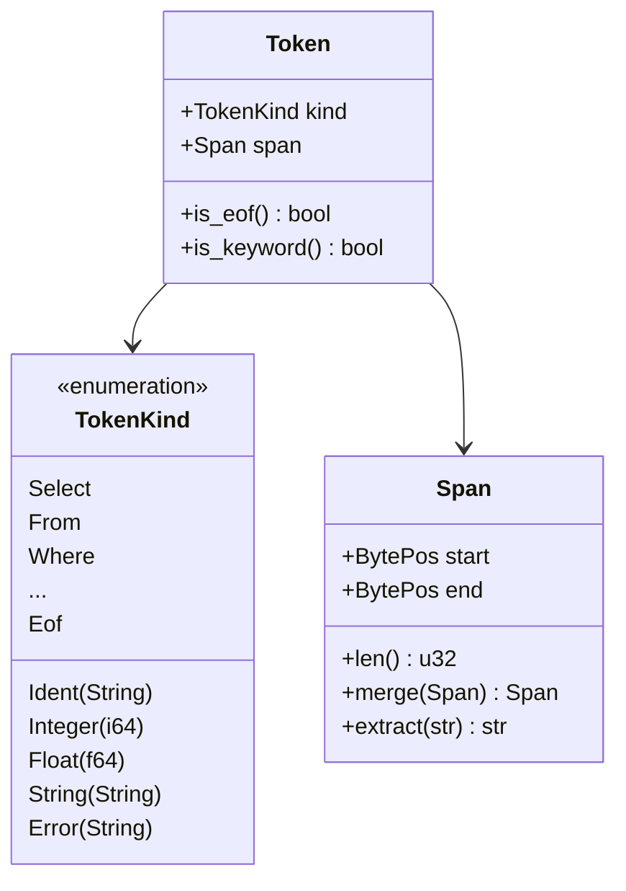
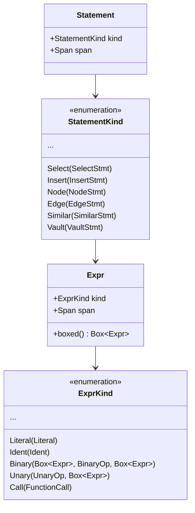

# Neumann Parser API Reference

## See Also

- **Explanation**: [Parser Design](../../explanation/parser-design.md)

---

## Public API

| Function | Description |
| --- | --- |
| `parse(source)` | Parse a single statement, returns `Result<Statement>` |
| `parse_all(source)` | Parse multiple semicolon-separated statements |
| `parse_expr(source)` | Parse a standalone expression |
| `tokenize(source)` | Tokenize source into a `Vec<Token>` |

## Source Files

| File | Purpose | Key Functions |
| --- | --- | --- |
| `lib.rs` | Public API exports | `parse()`, `parse_all()`, `parse_expr()`, `tokenize()` |
| `lexer.rs` | Tokenization (source to tokens) | `Lexer::next_token()`, `scan_ident()`, `scan_number()`, `scan_string()` |
| `token.rs` | Token definitions and keyword lookup | `TokenKind`, `keyword_from_str()` |
| `parser.rs` | Statement parsing (recursive descent) | `Parser::parse_statement()`, `parse_select()`, `parse_insert()` |
| `expr.rs` | Expression parsing (Pratt algorithm) | `ExprParser::parse_expr()`, `parse_expr_bp()`, `infix_binding_power()` |
| `ast.rs` | AST node definitions | `Statement`, `StatementKind`, `Expr`, `ExprKind` |
| `span.rs` | Source location tracking | `BytePos`, `Span`, `line_col()`, `get_line()` |
| `error.rs` | Error types with source context | `ParseError`, `ParseErrorKind`, `format_with_source()` |

## Token System



| Type | Description |
| --- | --- |
| `Token` | A token with its kind and span |
| `TokenKind` | Enum of all token variants (130+ variants including keywords, literals, operators) |
| `Lexer` | Stateful tokenizer that produces tokens from source |

## AST Types



| Type | Description |
| --- | --- |
| `Statement` | Top-level parsed statement with span |
| `StatementKind` | Enum of all statement variants (30+ variants) |
| `Expr` | Expression node with span |
| `ExprKind` | Enum of expression variants (20+ variants) |
| `Literal` | Literal values (Null, Boolean, Integer, Float, String) |
| `Ident` | Identifier with name and span |
| `BinaryOp` | Binary operators with precedence (18 operators) |
| `UnaryOp` | Unary operators (Not, Neg, BitNot) |

## Span Types

| Type | Description | Example |
| --- | --- | --- |
| `BytePos` | A byte offset into source text (u32) | `BytePos(7)` |
| `Span` | A range of bytes (start, end) | `Span { start: 0, end: 6 }` |
| `Spanned<T>` | A value paired with its source location | `Spanned::new(42, span)` |

```rust
// Span operations
let span1 = Span::from_offsets(0, 6);   // "SELECT"
let span2 = Span::from_offsets(7, 8);   // "*"
let merged = span1.merge(span2);         // "SELECT *"

// Extract source text
let source = "SELECT * FROM users";
let text = span1.extract(source);        // "SELECT"

// Line/column computation
let (line, col) = line_col(source, BytePos(7));  // (1, 8)
```

## Error Types

| Type | Description |
| --- | --- |
| `ParseError` | Error with kind, span, and optional help message |
| `ParseErrorKind` | Enum of error variants (10 kinds) |
| `ParseResult<T>` | `Result<T, ParseError>` |
| `Errors` | Collection of parse errors with iteration support |

```rust
pub enum ParseErrorKind {
    UnexpectedToken { found: TokenKind, expected: String },
    UnexpectedEof { expected: String },
    InvalidSyntax(String),
    InvalidNumber(String),
    UnterminatedString,
    UnknownCommand(String),
    DuplicateColumn(String),
    InvalidEscape(char),
    TooDeep,           // Expression nesting > 64 levels
    Custom(String),
}
```

## Statement Kinds

### SQL Statements

| Statement | Example | AST Type |
| --- | --- | --- |
| `Select` | `SELECT * FROM users WHERE id = 1` | `SelectStmt` |
| `Insert` | `INSERT INTO users (name) VALUES ('Alice')` | `InsertStmt` |
| `Update` | `UPDATE users SET name = 'Bob' WHERE id = 1` | `UpdateStmt` |
| `Delete` | `DELETE FROM users WHERE id = 1` | `DeleteStmt` |
| `CreateTable` | `CREATE TABLE users (id INT PRIMARY KEY)` | `CreateTableStmt` |
| `DropTable` | `DROP TABLE IF EXISTS users CASCADE` | `DropTableStmt` |
| `CreateIndex` | `CREATE UNIQUE INDEX idx ON users(email)` | `CreateIndexStmt` |
| `DropIndex` | `DROP INDEX idx_name` | `DropIndexStmt` |
| `ShowTables` | `SHOW TABLES` | unit |
| `Describe` | `DESCRIBE TABLE users` | `DescribeStmt` |

### Graph Statements

| Statement | Example | AST Type |
| --- | --- | --- |
| `Node` | `NODE CREATE person {name: 'Alice'}` | `NodeStmt` |
| `Edge` | `EDGE CREATE 1 -> 2 : FOLLOWS {since: 2023}` | `EdgeStmt` |
| `Neighbors` | `NEIGHBORS 'entity' OUTGOING follows` | `NeighborsStmt` |
| `Path` | `PATH SHORTEST 1 TO 5` | `PathStmt` |
| `Find` | `FIND NODE person WHERE age > 18` | `FindStmt` |

### Vector Statements

| Statement | Example | AST Type |
| --- | --- | --- |
| `Embed` | `EMBED STORE 'key' [0.1, 0.2, 0.3]` | `EmbedStmt` |
| `Similar` | `SIMILAR 'query' LIMIT 10 COSINE` | `SimilarStmt` |

### Domain Statements

| Statement | Example | AST Type |
| --- | --- | --- |
| `Vault` | `VAULT SET 'secret' 'value'` | `VaultStmt` |
| `Cache` | `CACHE STATS` | `CacheStmt` |
| `Blob` | `BLOB PUT 'file.txt' 'data'` | `BlobStmt` |
| `Blobs` | `BLOBS BY TAG 'important'` | `BlobsStmt` |
| `Chain` | `BEGIN CHAIN TRANSACTION` | `ChainStmt` |
| `Cluster` | `CLUSTER STATUS` | `ClusterStmt` |
| `Checkpoint` | `CHECKPOINT 'backup1'` | `CheckpointStmt` |
| `Entity` | `ENTITY CREATE 'key' {props} EMBEDDING [vec]` | `EntityStmt` |

## Expression Kinds

| Kind | Example | Notes |
| --- | --- | --- |
| `Literal` | `42`, `3.14`, `'hello'`, `TRUE`, `NULL` | Five literal types |
| `Ident` | `column_name` | Simple identifier |
| `Qualified` | `table.column` | Dot notation |
| `Binary` | `a + b`, `x AND y` | 18 binary operators |
| `Unary` | `NOT flag`, `-value`, `~bits` | 3 unary operators |
| `Call` | `COUNT(*)`, `MAX(price)` | Function with args |
| `Case` | `CASE WHEN x THEN y ELSE z END` | Simple and searched |
| `Subquery` | `(SELECT ...)` | Nested SELECT |
| `Exists` | `EXISTS (SELECT 1 ...)` | Existence test |
| `In` | `x IN (1, 2, 3)` or `x IN (SELECT...)` | Value list or subquery |
| `Between` | `x BETWEEN 1 AND 10` | Range check |
| `Like` | `name LIKE '%smith'` | Pattern matching |
| `IsNull` | `x IS NULL`, `y IS NOT NULL` | NULL check |
| `Array` | `[1, 2, 3]` | Array literal |
| `Tuple` | `(1, 2, 3)` | Tuple/row literal |
| `Cast` | `CAST(x AS INT)` | Type conversion |
| `Wildcard` | `*` | All columns |
| `QualifiedWildcard` | `table.*` | All columns from table |

## Binding Power Table

Each operator has left and right binding powers `(l_bp, r_bp)`:

| Precedence | Operators | Binding Power (l, r) | Associativity |
| --- | --- | --- | --- |
| 1 (lowest) | OR | (1, 2) | Left |
| 2 | AND | (3, 4) | Left |
| 3 | =, !=, <, <=, >, >= | (5, 6) | Left |
| 4 | `\|` (bitwise OR) | (7, 8) | Left |
| 5 | ^ (bitwise XOR) | (9, 10) | Left |
| 6 | & (bitwise AND) | (11, 12) | Left |
| 7 | <<, >> | (13, 14) | Left |
| 8 | +, -, `\|\|` (concat) | (15, 16) | Left |
| 9 | *, /, % | (17, 18) | Left |
| 10 (highest) | NOT, -, ~ (unary) | 19 (prefix) | Right |

Left associativity is achieved by having `r_bp > l_bp`.

## Grammar Rules

### SELECT Statement

```sql
SELECT [DISTINCT | ALL] columns
FROM table [alias]
[JOIN table ON condition | USING (cols)]...
[WHERE condition]
[GROUP BY exprs]
[HAVING condition]
[ORDER BY expr [ASC|DESC] [NULLS FIRST|LAST]]...
[LIMIT n]
[OFFSET n]
```

### CREATE TABLE Statement

```sql
CREATE TABLE [IF NOT EXISTS] name (
    column type [NULL|NOT NULL] [PRIMARY KEY] [UNIQUE]
                [DEFAULT expr] [CHECK(expr)]
                [REFERENCES table(col) [ON DELETE action] [ON UPDATE action]]
    [, ...]
    [, PRIMARY KEY (cols)]
    [, UNIQUE (cols)]
    [, FOREIGN KEY (cols) REFERENCES table(cols)]
    [, CHECK (expr)]
)
```

### Graph Operations

```sql
NODE CREATE label {properties}
NODE GET id
NODE DELETE id
NODE LIST [label]

EDGE CREATE from -> to : type {properties}
EDGE GET id
EDGE DELETE id
EDGE LIST [type]

NEIGHBORS node [OUTGOING|INCOMING|BOTH] [edge_type]
          [BY SIMILAR [vector] LIMIT n]

PATH [SHORTEST|ALL] from TO to [MAX depth]
```

### Vector Operations

```sql
EMBED STORE key [vector]
EMBED GET key
EMBED DELETE key
EMBED BUILD INDEX
EMBED BATCH [(key, [vector]), ...]

SIMILAR key|[vector] [LIMIT k] [COSINE|EUCLIDEAN|DOT_PRODUCT]
        [CONNECTED TO entity]
```

### Chain Operations

```text
BEGIN CHAIN TRANSACTION
COMMIT CHAIN
ROLLBACK CHAIN TO height

CHAIN HEIGHT
CHAIN TIP
CHAIN BLOCK height
CHAIN VERIFY
CHAIN HISTORY key
CHAIN SIMILAR [embedding] LIMIT n
CHAIN DRIFT FROM height TO height

SHOW CODEBOOK GLOBAL
SHOW CODEBOOK LOCAL domain
ANALYZE CODEBOOK TRANSITIONS
```

## Reserved Keywords

Keywords are case-insensitive. The lexer converts to uppercase for matching.

**SQL (70+ keywords)**: SELECT, DISTINCT, ALL, FROM, WHERE, INSERT, INTO,
VALUES, UPDATE, SET, DELETE, CREATE, DROP, TABLE, INDEX, AND, OR, NOT, NULL, IS,
IN, LIKE, BETWEEN, ORDER, BY, ASC, DESC, NULLS, FIRST, LAST, LIMIT, OFFSET,
GROUP, HAVING, JOIN, INNER, LEFT, RIGHT, FULL, OUTER, CROSS, NATURAL, ON, USING,
AS, PRIMARY, KEY, UNIQUE, REFERENCES, FOREIGN, CHECK, DEFAULT, CASCADE,
RESTRICT, IF, EXISTS, SHOW, TABLES, UNION, INTERSECT, EXCEPT, CASE, WHEN, THEN,
ELSE, END, CAST, ANY

**Types (16 keywords)**: INT, INTEGER, BIGINT, SMALLINT, FLOAT, DOUBLE, REAL,
DECIMAL, NUMERIC, VARCHAR, CHAR, TEXT, BOOLEAN, DATE, TIME, TIMESTAMP

**Aggregates (5 keywords)**: COUNT, SUM, AVG, MIN, MAX

**Graph (16 keywords)**: NODE, EDGE, NEIGHBORS, PATH, GET, LIST, STORE,
OUTGOING, INCOMING, BOTH, SHORTEST, PROPERTIES, LABEL, VERTEX, VERTICES, EDGES

**Vector (10 keywords)**: EMBED, SIMILAR, VECTOR, EMBEDDING, DIMENSION,
DISTANCE, COSINE, EUCLIDEAN, DOT_PRODUCT, BUILD

**Unified (6 keywords)**: FIND, WITH, RETURN, MATCH, ENTITY, CONNECTED

**Domain (30+ keywords)**: VAULT, GRANT, REVOKE, ROTATE, CACHE, INIT, STATS,
CLEAR, EVICT, PUT, SEMANTIC, THRESHOLD, CHECKPOINT, ROLLBACK, CHAIN, BEGIN,
COMMIT, TRANSACTION, HISTORY, DRIFT, CODEBOOK, GLOBAL, LOCAL, ANALYZE, HEIGHT,
TIP, BLOCK, CLUSTER, CONNECT, DISCONNECT, STATUS, NODES, LEADER, BLOB, BLOBS,
INFO, LINK, TAG, VERIFY, GC, REPAIR

### Contextual Keywords

These keywords can be used as identifiers in expression contexts (column names,
etc.):

```rust
pub fn is_contextual_keyword(&self) -> bool {
    matches!(self,
        Status | Nodes | Leader | Connect | Disconnect | Cluster |
        Blobs | Info | Link | Unlink | Links | Tag | Untag | Verify | Gc | Repair |
        Height | Transitions | Tip | Block | Codebook | Global | Local | Drift |
        Begin | Commit | Transaction | ...
    )
}
```

## String Escape Sequences

| Escape | Result |
| --- | --- |
| `\n` | Newline |
| `\r` | Carriage return |
| `\t` | Tab |
| `\\` | Backslash |
| `\'` | Single quote |
| `\"` | Double quote |
| `\0` | Null character |
| `''` | Single quote (SQL-style doubled) |
| `\x` | Unknown: preserved as `\x` |

## Performance

| Operation | Complexity | Notes |
| --- | --- | --- |
| Tokenize | O(n) | Single pass, no backtracking |
| Parse | O(n) | Single pass, constant stack per token |
| Total | O(n) | Where n = input length |

### Memory Usage

- Lexer: O(1) -- only stores position and one peeked character
- Parser: O(1) -- only stores current and peeked token
- AST: O(n) -- proportional to number of nodes
- Span: 8 bytes per span (two u32 values)

### Optimizations

1. **Keyword lookup**: O(1) via match statement on uppercase string
2. **Token comparison**: Uses `std::mem::discriminant` for enum comparison
3. **Span tracking**: Constant-time merge operation
4. **No allocations during parsing**: Identifiers and strings owned in tokens

## Related Modules

| Module | Relationship |
| --- | --- |
| `query_router` | Consumes AST and executes queries against engines |
| `neumann_shell` | Uses parser for interactive REPL commands |
| `tensor_chain` | Chain statements (BEGIN, COMMIT, HISTORY) parsed here |
| `tensor_vault` | Vault statements (SET, GET, GRANT) parsed here |
| `tensor_cache` | Cache statements (INIT, STATS, PUT) parsed here |
| `tensor_blob` | Blob statements (PUT, GET, TAG) parsed here |

## Testing

The parser has comprehensive test coverage including:

- **Unit tests in each module**: Token, span, lexer, parser, expression tests
- **Integration tests**: Complex SQL queries, multi-statement parsing
- **Edge case tests**: Unterminated strings, deeply nested expressions,
  ambiguous operators
- **Fuzz targets**: `parser_parse`, `parser_parse_all`, `parser_parse_expr`,
  `parser_tokenize`

```bash
# Run parser tests
cargo test -p neumann_parser

# Run parser fuzz targets
cargo +nightly fuzz run parser_parse -- -max_total_time=60
cargo +nightly fuzz run parser_tokenize -- -max_total_time=60
```
