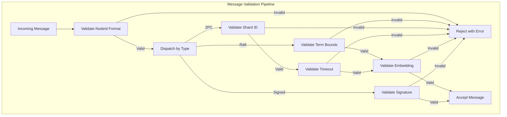

# Tensor Chain API Reference

## See Also

- **Explanation**: [Consensus Protocols](../../explanation/consensus-protocols.md) |
  [Distributed Transactions](../../explanation/distributed-transactions.md) |
  [Semantic Conflict Detection](../../explanation/semantic-conflict-detection.md) |
  [Formal Verification](../../explanation/formal-verification.md) |
  [Snapshot Streaming](../../explanation/snapshot-streaming.md) |
  [TCP Transport](../../explanation/tcp-transport.md)
- **How-to**: [Configure Raft](../../how-to/configure-raft.md) |
  [Configure 2PC](../../how-to/configure-2pc.md) |
  [Deploy Cluster](../../how-to/deploy-cluster.md) |
  [Handle Transaction Conflicts](../../how-to/handle-transaction-conflicts.md) |
  [Monitoring Setup](../../how-to/monitoring-setup.md)

---

## Core Types

| Type | Module | Description |
| --- | --- | --- |
| `TensorChain` | `lib.rs` | Main API for chain operations, transaction management |
| `Block` | `block.rs` | Block structure with header, transactions, signatures |
| `BlockHeader` | `block.rs` | Height, prev_hash, delta_embedding, quantized_codes |
| `Transaction` | `block.rs` | Put, Delete, Update operations |
| `ChainConfig` | `lib.rs` | Node ID, max transactions, conflict threshold, auto-merge |
| `ChainError` | `error.rs` | Error types for all chain operations |
| `ChainMetrics` | `lib.rs` | Aggregated metrics from all components |

## Consensus Types

| Type | Module | Description |
| --- | --- | --- |
| `RaftNode` | `raft.rs` | Raft state machine with leader election, log replication |
| `RaftState` | `raft.rs` | Follower, Candidate, or Leader |
| `RaftConfig` | `raft.rs` | Election timeout, heartbeat interval, fast-path settings |
| `RaftStats` | `raft.rs` | Fast-path acceptance, heartbeat timing, quorum tracking |
| `QuorumTracker` | `raft.rs` | Tracks heartbeat responses to detect quorum loss |
| `SnapshotMetadata` | `raft.rs` | Log compaction point with hash and membership config |
| `LogEntry` | `network.rs` | Raft log entry with term, index, and data |
| `ConsensusManager` | `consensus.rs` | Semantic conflict detection and transaction merging |
| `DeltaVector` | `consensus.rs` | Sparse delta embedding with affected keys |
| `ConflictClass` | `consensus.rs` | Orthogonal, LowConflict, Ambiguous, Conflicting, Identical, Opposite |
| `FastPathValidator` | `validation.rs` | Block similarity validation for fast-path acceptance |
| `FastPathState` | `raft.rs` | Per-leader embedding history for fast-path |
| `TransferState` | `raft.rs` | Active leadership transfer tracking |
| `HeartbeatStats` | `raft.rs` | Heartbeat success/failure counters |

## Distributed Transaction Types

| Type | Module | Description |
| --- | --- | --- |
| `DistributedTxCoordinator` | `distributed_tx.rs` | 2PC coordinator with timeout and retry |
| `DistributedTransaction` | `distributed_tx.rs` | Transaction spanning multiple shards |
| `TxPhase` | `distributed_tx.rs` | Preparing, Prepared, Committing, Committed, Aborting, Aborted |
| `PrepareVote` | `distributed_tx.rs` | Yes (with lock handle), No (with reason), Conflict |
| `LockManager` | `distributed_tx.rs` | Key-level locking for transaction isolation |
| `KeyLock` | `distributed_tx.rs` | Lock on a key with timeout and handle |
| `TxWal` | `tx_wal.rs` | Write-ahead log for crash recovery |
| `TxWalEntry` | `tx_wal.rs` | WAL entry types: TxBegin, PrepareVote, PhaseChange, TxComplete |
| `TxRecoveryState` | `tx_wal.rs` | Reconstructed state from WAL replay |
| `PrepareRequest` | `distributed_tx.rs` | Request to prepare a transaction on a shard |
| `CommitRequest` | `distributed_tx.rs` | Request to commit a prepared transaction |
| `AbortRequest` | `distributed_tx.rs` | Request to abort a transaction |
| `CoordinatorState` | `distributed_tx.rs` | Serializable coordinator state for persistence |
| `ParticipantState` | `distributed_tx.rs` | Serializable participant state for persistence |

## Gossip Types

| Type | Module | Description |
| --- | --- | --- |
| `GossipMembershipManager` | `gossip.rs` | SWIM-style gossip with signing support |
| `GossipConfig` | `gossip.rs` | Fanout, interval, suspicion timeout, signature requirements |
| `GossipMessage` | `gossip.rs` | Sync, Suspect, Alive, PingReq, PingAck |
| `GossipNodeState` | `gossip.rs` | Node health, Lamport timestamp, incarnation |
| `LWWMembershipState` | `gossip.rs` | CRDT for conflict-free state merging |
| `PendingSuspicion` | `gossip.rs` | Suspicion timer tracking |
| `HealProgress` | `gossip.rs` | Recovery tracking for partitioned nodes |
| `SignedGossipMessage` | `signing.rs` | Gossip message with Ed25519 signature |

## Deadlock Detection Types

| Type | Module | Description |
| --- | --- | --- |
| `DeadlockDetector` | `deadlock.rs` | Cycle detection with configurable victim selection |
| `WaitForGraph` | `deadlock.rs` | Directed graph of transaction dependencies |
| `DeadlockInfo` | `deadlock.rs` | Detected cycle with selected victim |
| `VictimSelectionPolicy` | `deadlock.rs` | Youngest, Oldest, LowestPriority, MostLocks |
| `DeadlockStats` | `deadlock.rs` | Detection timing and cycle length statistics |
| `WaitInfo` | `deadlock.rs` | Lock conflict information for wait-graph edges |

## Identity and Signing Types

| Type | Module | Description |
| --- | --- | --- |
| `Identity` | `signing.rs` | Ed25519 private key (zeroized on drop) |
| `PublicIdentity` | `signing.rs` | Ed25519 public key for verification |
| `SignedMessage` | `signing.rs` | Message envelope with signature and replay protection |
| `ValidatorRegistry` | `signing.rs` | Registry of known validator public keys |
| `SequenceTracker` | `signing.rs` | Replay attack detection via sequence numbers |
| `SequenceTrackerConfig` | `signing.rs` | Max age, max entries, cleanup interval |

## Message Validation Types

| Type | Module | Description |
| --- | --- | --- |
| `MessageValidationConfig` | `message_validation.rs` | Bounds for DoS prevention |
| `CompositeValidator` | `message_validation.rs` | Validates all message types |
| `EmbeddingValidator` | `message_validation.rs` | Checks dimension, magnitude, NaN/Inf |
| `MessageValidator` | `message_validation.rs` | Trait for pluggable validation |

## Message Types

### Raft Messages

Raft communication uses a single `Message` enum dispatched by type:

| Message Variant | Direction | Purpose |
| --- | --- | --- |
| `RequestVote` | Candidate -> All | Request votes during election |
| `RequestVoteResponse` | Peer -> Candidate | Grant or deny vote |
| `PreVote` | Candidate -> All | Pre-vote check before term increment |
| `PreVoteResponse` | Peer -> Candidate | Grant or deny pre-vote |
| `AppendEntries` | Leader -> Follower | Replicate log entries / heartbeat |
| `AppendEntriesResponse` | Follower -> Leader | Acknowledge replication |
| `InstallSnapshot` | Leader -> Follower | Transfer state snapshot chunk |
| `InstallSnapshotResponse` | Follower -> Leader | Acknowledge snapshot chunk |
| `TransferLeadership` | Leader -> Target | Initiate leadership transfer |

### 2PC Messages

| Message | Direction | Purpose |
| --- | --- | --- |
| `TxPrepareMsg` | Coordinator -> Participant | Start prepare phase with ops and delta |
| `TxVote` / `TxPrepareResponse` | Participant -> Coordinator | Vote Yes/No/Conflict |
| `TxCommitMsg` | Coordinator -> Participant | Commit decision |
| `TxAbortMsg` | Coordinator -> Participant | Abort decision |
| `TxAck` / `TxAckMsg` | Participant -> Coordinator | Acknowledge commit/abort |

### Gossip Messages

```rust
pub enum GossipMessage {
    /// Sync message with piggy-backed node states
    Sync {
        sender: NodeId,
        states: Vec<GossipNodeState>,
        sender_time: u64,  // Lamport timestamp
    },

    /// Suspect a node of failure
    Suspect {
        reporter: NodeId,
        suspect: NodeId,
        incarnation: u64,
    },

    /// Refute suspicion by proving aliveness
    Alive {
        node_id: NodeId,
        incarnation: u64,  // Incremented to refute
    },

    /// Indirect ping request (SWIM protocol)
    PingReq {
        origin: NodeId,
        target: NodeId,
        sequence: u64,
    },

    /// Indirect ping response
    PingAck {
        origin: NodeId,
        target: NodeId,
        sequence: u64,
        success: bool,
    },
}
```

### Signed Message Envelope

```rust
pub struct SignedMessage {
    pub sender: NodeId,           // Derived from public key
    pub public_key: [u8; 32],     // Ed25519 verifying key
    pub payload: Vec<u8>,         // Message content
    pub signature: Vec<u8>,       // 64-byte Ed25519 signature
    pub sequence: u64,            // Replay protection
    pub timestamp_ms: u64,        // Freshness check
}

// Signature covers: sender || sequence || timestamp || payload
```

## Error Types

`ChainError` covers all error conditions:

| Variant | Trigger |
| --- | --- |
| `InvalidBlock` | Block fails validation (hash, signature, structure) |
| `ConflictDetected` | Semantic conflict between concurrent transactions |
| `ConsensusFailure` | Raft quorum lost or leader unavailable |
| `LockTimeout` | Lock acquisition exceeded timeout |
| `DeadlockDetected` | Cycle in wait-for graph |
| `TransactionAborted` | Transaction aborted (conflict, timeout, or victim selection) |
| `InvalidTransaction` | Malformed transaction or missing fields |
| `NotLeader` | Write attempt on non-leader node |
| `SnapshotError` | Snapshot creation, transfer, or restoration failure |
| `WalError` | Write-ahead log read/write failure |
| `SignatureError` | Ed25519 signature verification failure |
| `ReplayDetected` | Message sequence number regression |
| `ValidationError` | Message bounds check failure |

## Configuration Parameters

### RaftConfig

| Field | Type | Default | Description |
| --- | --- | --- | --- |
| `election_timeout` | `(u64, u64)` | `(150, 300)` | Random timeout range in ms |
| `heartbeat_interval` | `u64` | `50` | Heartbeat interval in ms |
| `similarity_threshold` | `f32` | `0.95` | Fast-path similarity threshold |
| `enable_fast_path` | `bool` | `true` | Enable fast-path validation |
| `enable_pre_vote` | `bool` | `true` | Enable pre-vote phase |
| `enable_geometric_tiebreak` | `bool` | `true` | Enable geometric tie-breaking |
| `geometric_tiebreak_threshold` | `f32` | `0.3` | Minimum similarity for tiebreak |
| `snapshot_threshold` | `usize` | `10,000` | Entries before compaction |
| `snapshot_trailing_logs` | `usize` | `100` | Entries to keep after snapshot |
| `snapshot_chunk_size` | `usize` | `1MB` | Chunk size for snapshot transfer |
| `transfer_timeout_ms` | `u64` | `1,000` | Leadership transfer timeout |
| `compaction_check_interval` | `u64` | `10` | Ticks between compaction checks |
| `compaction_cooldown_ms` | `u64` | `60,000` | Minimum time between compactions |
| `snapshot_max_memory` | `usize` | `256MB` | Max memory for snapshot buffering |
| `auto_heartbeat` | `bool` | `true` | Spawn heartbeat task on leader election |
| `max_heartbeat_failures` | `u32` | `3` | Failures before logging warning |

### DistributedTxConfig

| Field | Type | Default | Description |
| --- | --- | --- | --- |
| `max_concurrent` | `usize` | `100` | Maximum concurrent transactions |
| `prepare_timeout_ms` | `u64` | `5,000` | Prepare phase timeout |
| `commit_timeout_ms` | `u64` | `10,000` | Commit phase timeout |
| `orthogonal_threshold` | `f32` | `0.1` | Cosine threshold for orthogonality |
| `optimistic_locking` | `bool` | `true` | Enable semantic conflict detection |

### GossipConfig

| Field | Type | Default | Description |
| --- | --- | --- | --- |
| `fanout` | `usize` | `3` | Peers per gossip round |
| `gossip_interval_ms` | `u64` | `200` | Interval between rounds |
| `suspicion_timeout_ms` | `u64` | `5,000` | Time before failure declaration |
| `max_states_per_message` | `usize` | `20` | State limit per message |
| `geometric_routing` | `bool` | `true` | Use embedding-based peer selection |
| `indirect_ping_count` | `usize` | `3` | Indirect pings on direct failure |
| `indirect_ping_timeout_ms` | `u64` | `500` | Timeout for indirect pings |
| `require_signatures` | `bool` | `false` | Require Ed25519 signatures |
| `max_message_age_ms` | `u64` | `300,000` | Maximum signed message age |

### DeadlockDetectorConfig

| Field | Type | Default | Description |
| --- | --- | --- | --- |
| `enabled` | `bool` | `true` | Enable deadlock detection |
| `detection_interval_ms` | `u64` | `100` | Detection cycle interval |
| `victim_policy` | `VictimSelectionPolicy` | `Youngest` | Victim selection policy |
| `max_cycle_length` | `usize` | `100` | Maximum detectable cycle length |
| `auto_abort_victim` | `bool` | `true` | Automatically abort victim |

### MessageValidationConfig

| Field | Type | Default | Description |
| --- | --- | --- | --- |
| `enabled` | `bool` | `true` | Enable validation |
| `max_term` | `u64` | `u64::MAX - 1` | Prevent overflow attacks |
| `max_shard_id` | `u64` | `65,536` | Bound shard addressing |
| `max_tx_timeout_ms` | `u64` | `300,000` | Maximum transaction timeout |
| `max_node_id_len` | `usize` | `256` | Maximum node ID length |
| `max_key_len` | `usize` | `4,096` | Maximum key length |
| `max_embedding_dimension` | `usize` | `65,536` | Prevent huge allocations |
| `max_embedding_magnitude` | `f32` | `1,000,000` | Detect invalid values |
| `max_query_len` | `usize` | `1MB` | Maximum query string length |
| `max_message_age_ms` | `u64` | `300,000` | Reject stale/replayed messages |
| `max_blocks_per_request` | `usize` | `1,000` | Limit block range requests |
| `max_snapshot_chunk_size` | `usize` | `10MB` | Limit snapshot chunk size |

## Message Validation Pipeline

All incoming messages pass through validation before processing:



### Embedding Validation

```rust
pub struct EmbeddingValidator {
    max_dimension: usize,    // Default: 65,536
    max_magnitude: f32,      // Default: 1,000,000
}

impl EmbeddingValidator {
    pub fn validate(&self, embedding: &SparseVector, field: &str) -> Result<()> {
        // 1. Dimension bounds (reject zero and oversized)
        // 2. NaN/Inf detection (prevents computation errors)
        // 3. Magnitude bounds (prevents DoS via huge vectors)
        // 4. Position validity (sorted, within bounds)
        Ok(())
    }
}
```

### Replay Protection

```rust
pub struct SequenceTracker {
    sequences: DashMap<NodeId, (u64, Instant)>,
    config: SequenceTrackerConfig,
}

impl SequenceTracker {
    pub fn check_and_record(
        &self,
        sender: &NodeId,
        sequence: u64,
        timestamp_ms: u64,
    ) -> Result<()> {
        // 1. Reject messages from the future (allow 1 min clock skew)
        // 2. Reject stale messages (default: 5 min max age)
        // 3. Check sequence number is strictly increasing
        Ok(())
    }
}
```

## Identity and Signing

### Identity Generation

```rust
pub struct Identity {
    signing_key: SigningKey,  // Ed25519 private key (zeroized on drop)
}

impl Identity {
    pub fn generate() -> Self;

    /// NodeId = BLAKE2b-128(domain || public_key)
    /// 16 bytes = 32 hex characters
    pub fn node_id(&self) -> NodeId;

    /// Embedding = BLAKE2b-512(domain || public_key) -> 16 f32 coords
    /// Normalized to [-1, 1] for geometric operations
    pub fn to_embedding(&self) -> SparseVector;
}
```

### Quorum Calculation

```rust
pub fn quorum_size(total_nodes: usize) -> usize {
    (total_nodes / 2) + 1
}

// Examples:
// 3 nodes: quorum = 2
// 5 nodes: quorum = 3
// 7 nodes: quorum = 4
```

## Dependencies

| Module | Relationship |
| --- | --- |
| `tensor_store` | Provides `TensorStore` for persistence, `SparseVector` for embeddings, `ArchetypeRegistry` for delta compression |
| `graph_engine` | Blocks linked via graph edges, chain structure built on graph |
| `tensor_compress` | Int8 quantization for delta embeddings (4x compression) |
| `tensor_checkpoint` | Snapshot persistence for crash recovery |

## Performance Characteristics

| Operation | Time | Notes |
| --- | --- | --- |
| Transaction commit | ~50us | Single transaction block |
| Conflict detection | ~1us | Cosine + Jaccard calculation |
| Deadlock detection | ~350ns | DFS cycle detection |
| Gossip round | ~200ms | Configurable interval |
| Heartbeat | ~50ms | Leader to all followers |
| Fast-path validation | ~2us | Similarity check only |
| Full validation | ~50us | Complete block verification |
| Lock acquisition | ~100ns | Uncontended case |
| Lock acquisition (contended) | ~10us | With wait-graph update |
| Signature verification | ~50us | Ed25519 verify |
| Message validation | ~1us | Bounds checking |

## Monitoring Metrics

| Metric | Warning Threshold | Critical Threshold |
| --- | --- | --- |
| `heartbeat_success_rate` | < 0.95 | < 0.80 |
| `fast_path_rate` | < 0.50 | < 0.20 |
| `commit_rate` | < 0.80 | < 0.50 |
| `conflict_rate` | > 0.10 | > 0.30 |
| `deadlocks_detected` | > 0/min | > 10/min |
| `quorum_lost_events` | > 0/hour | > 0/min |
