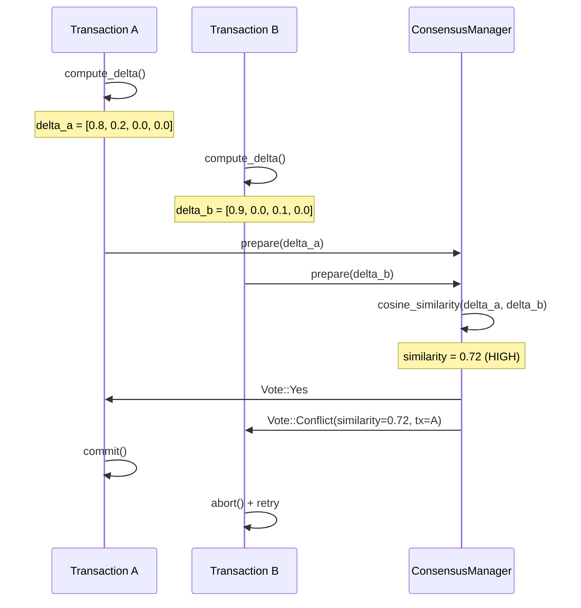
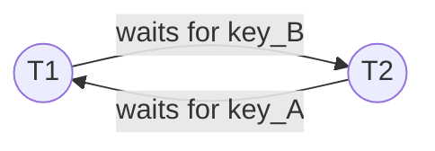
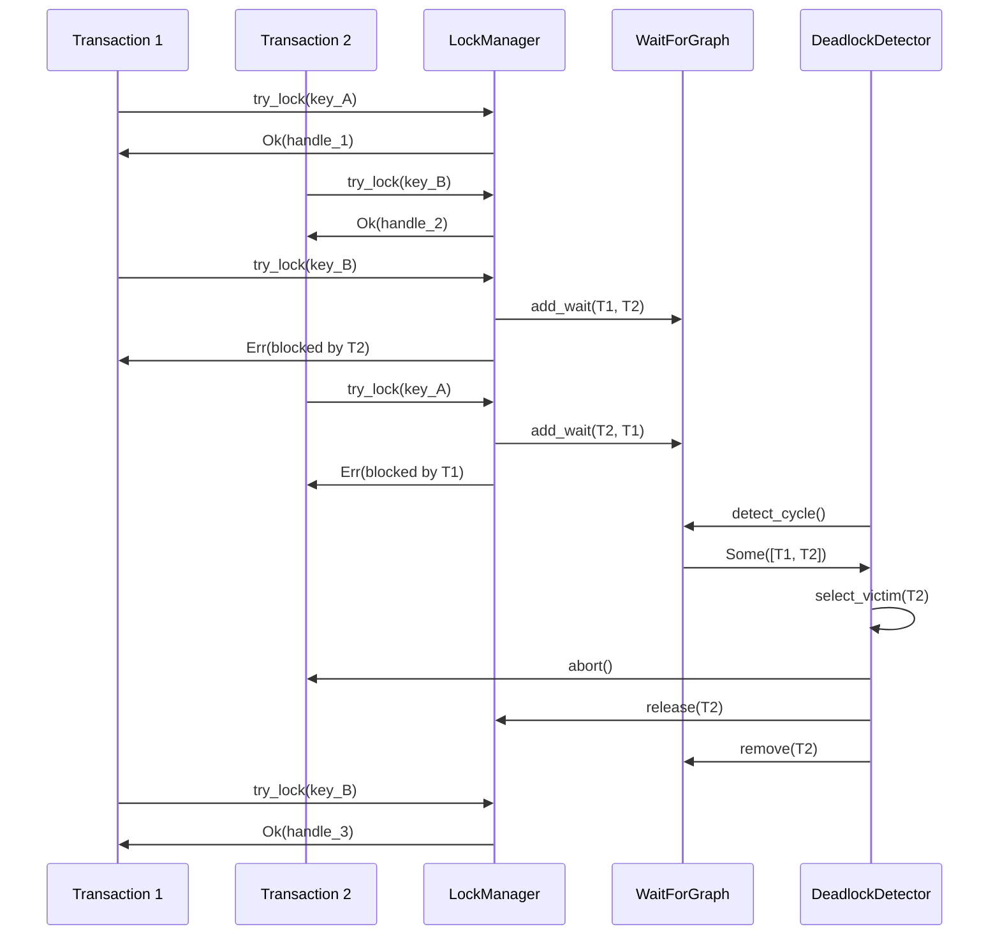
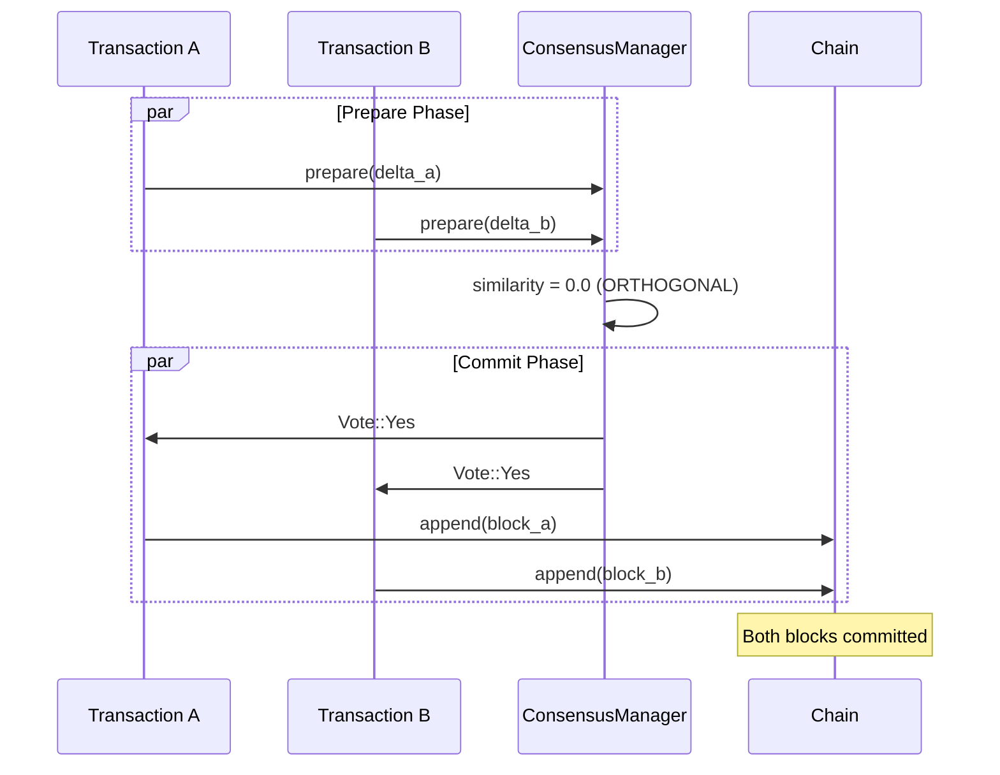

# Worked Examples

This tutorial demonstrates tensor_chain's conflict detection, deadlock
resolution, and orthogonal transaction merging through detailed scenarios.

## Prerequisites

- Understanding of transaction workspaces
- Familiarity with delta embeddings
- Basic knowledge of distributed transactions

## Scenario 1: Semantic Conflict Detection

Two transactions modify overlapping data. The system detects the conflict
using delta embedding similarity.

### Setup

```rust
use tensor_chain::{TensorStore, TransactionManager};
use tensor_chain::block::Transaction;

let store = TensorStore::new();
let manager = TransactionManager::new();

// Initialize account data
store.put("account:1", serialize(&Account { balance: 1000 }))?;
store.put("account:2", serialize(&Account { balance: 2000 }))?;
```

### Transaction Execution

```rust
// Transaction A: Transfer from account:1 to account:2
let tx_a = manager.begin(&store)?;
tx_a.add_operation(Transaction::Put {
    key: "account:1".to_string(),
    data: serialize(&Account { balance: 900 }),  // -100
})?;
tx_a.add_operation(Transaction::Put {
    key: "account:2".to_string(),
    data: serialize(&Account { balance: 2100 }), // +100
})?;

// Transaction B: Transfer from account:1 to account:3 (conflicts on account:1)
let tx_b = manager.begin(&store)?;
tx_b.add_operation(Transaction::Put {
    key: "account:1".to_string(),
    data: serialize(&Account { balance: 800 }),  // -200
})?;
tx_b.add_operation(Transaction::Put {
    key: "account:3".to_string(),
    data: serialize(&Account { balance: 200 }),  // +200
})?;
```

### Conflict Detection Flow



### Classification Table

| Similarity Range | Classification | Action |
| --- | --- | --- |
| 0.0 - 0.1 | Orthogonal | Parallel commit OK |
| 0.1 - 0.5 | Low overlap | Merge possible |
| 0.5 - 0.9 | Conflicting | Serialize execution |
| 0.9 - 1.0 | Parallel | Abort one |

### Application Retry Logic

```rust
// Retry with exponential backoff
let mut attempt = 0;
let max_attempts = 5;

loop {
    let workspace = manager.begin(&store)?;

    // Re-read current state
    let account = store.get("account:1")?;

    // Apply changes
    workspace.add_operation(Transaction::Put {
        key: "account:1".to_string(),
        data: serialize(&Account {
            balance: account.balance - 200,
        }),
    })?;

    // Try to commit
    match commit_with_conflict_check(&workspace, &manager) {
        Ok(()) => break,
        Err(ConflictError { similarity, .. }) => {
            attempt += 1;
            if attempt >= max_attempts {
                return Err("max retries exceeded");
            }

            // Exponential backoff with jitter
            let backoff = (100 * 2u64.pow(attempt)) + rand::random::<u64>() % 50;
            std::thread::sleep(Duration::from_millis(backoff));
        }
    }
}
```

## Scenario 2: Deadlock Detection and Resolution

Two transactions wait on each other's locks, creating a cycle in the
wait-for graph.

### Setup

```text
Transaction T1: needs locks on [key_A, key_B]
Transaction T2: needs locks on [key_B, key_A]

Timeline:
  T1 acquires key_A
  T2 acquires key_B
  T1 waits for key_B (held by T2)
  T2 waits for key_A (held by T1)
  -> DEADLOCK
```

### Wait-For Graph



### Detection Flow



### Victim Selection

| Criterion | Weight | Description |
| --- | --- | --- |
| Lock count | 0.3 | Fewer locks = preferred victim |
| Transaction age | 0.3 | Younger = preferred victim |
| Priority | 0.4 | Lower priority = preferred victim |

```rust
fn select_victim(cycle: &[u64], priorities: &HashMap<u64, u32>) -> u64 {
    cycle
        .iter()
        .min_by_key(|&&tx_id| {
            let priority = priorities.get(&tx_id).copied().unwrap_or(0);
            let lock_count = lock_manager.lock_count_for_transaction(tx_id);
            (priority, lock_count)
        })
        .copied()
        .unwrap()
}
```

### Configuration

```toml
[deadlock]
detection_interval_ms = 100
max_cycle_length = 10
victim_selection = "youngest"  # or "lowest_priority", "fewest_locks"
```

## Scenario 3: Orthogonal Transaction Merging

Two transactions modify non-overlapping data with orthogonal delta
embeddings. They can be committed in parallel.

### Setup

```rust
// Transaction A: Update user preferences
let tx_a = manager.begin(&store)?;
tx_a.add_operation(Transaction::Put {
    key: "user:1:prefs".to_string(),
    data: serialize(&Preferences { theme: "dark" }),
})?;
tx_a.set_before_embedding(vec![0.0; 128]);
tx_a.compute_delta(vec![1.0, 0.0, 0.0, 0.0]);  // Direction: X

// Transaction B: Update product inventory
let tx_b = manager.begin(&store)?;
tx_b.add_operation(Transaction::Put {
    key: "product:42:stock".to_string(),
    data: serialize(&Stock { quantity: 100 }),
})?;
tx_b.set_before_embedding(vec![0.0; 128]);
tx_b.compute_delta(vec![0.0, 1.0, 0.0, 0.0]);  // Direction: Y
```

### Parallel Commit



### Orthogonality Analysis

| Transaction A | Transaction B | Overlap | Similarity | Can Merge? |
| --- | --- | --- | --- | --- |
| user:1:prefs | product:42:stock | None | 0.00 | Yes |
| user:1:balance | user:2:balance | None | 0.15 | Yes |
| user:1:balance | user:1:prefs | user:1 | 0.30 | Maybe |
| account:1 | account:1 | Full | 0.95 | No |

### Merge Implementation

```rust
// Find merge candidates
let candidates = manager.find_merge_candidates(
    &tx_a,
    0.1,      // orthogonal threshold
    60_000,   // merge window (60s)
);

if !candidates.is_empty() {
    // Create merged block with multiple transactions
    let mut merged_ops = tx_a.operations();
    for candidate in &candidates {
        merged_ops.extend(candidate.workspace.operations());
    }

    // Compute merged delta
    let merged_delta = tx_a.to_delta_vector();
    for candidate in &candidates {
        merged_delta = merged_delta.add(&candidate.delta);
    }

    // Single block contains both transactions
    let block = Block::new(header, merged_ops);
    chain.append(block)?;

    // Mark all as committed
    tx_a.mark_committed();
    for candidate in candidates {
        candidate.workspace.mark_committed();
    }
}
```

## Summary

| Scenario | Detection Method | Resolution |
| --- | --- | --- |
| Conflict | Delta similarity > 0.5 | Serialize, retry loser |
| Deadlock | Wait-for graph cycle | Abort victim, retry |
| Orthogonal | Delta similarity < 0.1 | Parallel commit/merge |

## Further Reading

- [Embedding State Machine](../concepts/embedding-state.md)
- [Transaction Workspace](../architecture/transaction-workspace.md)
- [Distributed Transactions](../concepts/distributed-transactions.md)
